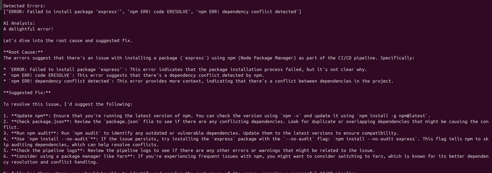

# AI-Powered CI/CD Failure Analyzer

[](https://github.com/simranGagrawal/ai-cicd-failure-analyzer/actions/workflows/ci.yml)

> f1cbcc6 (Improve README Formatting and Add demo screenshot to README)
A Python tool that analyzes CI/CD pipeline logs and uses a local LLM (Ollama + Llama3) to automatically generate root cause analysis and suggested fixes for build failures.

---

## Problem

CI/CD pipelines often fail due to dependency conflicts, configuration issues, or build errors. Engineers usually need to manually read logs to understand the root cause.

---

## Solution

This tool parses CI/CD logs, extracts error messages, and sends them to a locally hosted LLM to generate automated troubleshooting suggestions.

---

## Architecture

```
CI/CD Logs
     ↓
Python Log Parser
     ↓
Ollama Local API
     ↓
LLM Analysis (Llama3)
     ↓
Root Cause + Suggested Fix
```

---

## Tech Stack

- Python
- Requests
- Ollama
- Llama3
- Docker
- GitHub Actions

---

## Example Output

```
Detected Errors:
["ERROR: Failed to install package 'express'",
 "npm ERR! code ERESOLVE",
 "npm ERR! dependency conflict detected"]

AI Analysis:

Root Cause:
Dependency conflict detected during npm installation.

Suggested Fix:
Check package.json versions or run npm install with --legacy-peer-deps.
```

---

## How to Run

### 1. Start Ollama

```bash
ollama serve
```

### 2. Run the analyzer

```bash
python src/analyzer.py logs/sample_pipeline.log
```

---

## Future Improvements

- Support multiple log formats
- CI/CD pipeline integration
- Docker networking improvements
- Slack alert integration

## Demo

Below is an example of the analyzer detecting CI/CD errors and generating AI-based root cause analysis.


