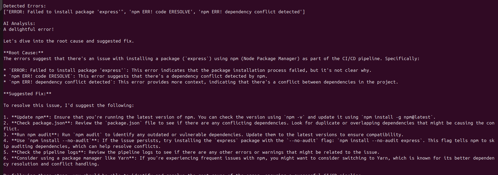
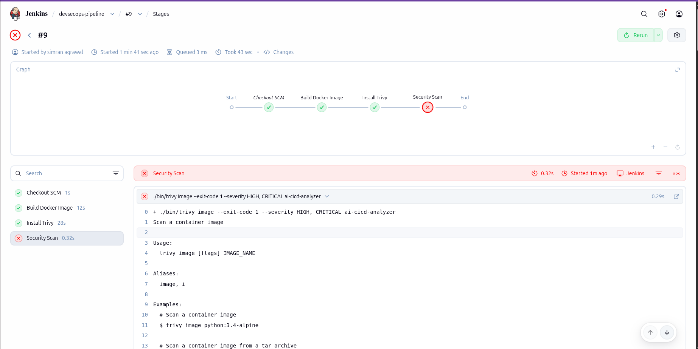
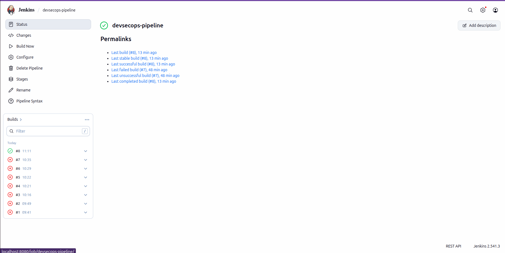

# 🚀 AI-Powered DevSecOps Pipeline (CI/CD Failure Analyzer)

[](https://github.com/simranGagrawal/ai-cicd-failure-analyzer/actions/workflows/ci.yml)

A Python-based tool that analyzes CI/CD pipeline logs using a local LLM (Ollama + Llama3) and is integrated into a **DevSecOps pipeline** to automate both failure analysis and security validation.

---

## 🔴 Problem

CI/CD pipelines often fail due to dependency conflicts, configuration issues, or build errors.  
Additionally, applications are frequently deployed without proper security checks, increasing the risk of vulnerabilities reaching production.

---

## 🟢 Solution

This project combines:

- 🤖 **AI-based CI/CD failure analysis**
- 🔐 **DevSecOps pipeline with security scanning**

It:
- Parses CI/CD logs and identifies errors  
- Uses a local LLM to generate root cause and fixes  
- Builds application using Docker  
- Scans container images for vulnerabilities using Trivy  
- **Blocks deployment if HIGH/CRITICAL vulnerabilities are detected**

---

## 🏗️ Architecture
GitHub Repo
↓
Jenkins Pipeline
↓
Docker Build
↓
Trivy Security Scan
↓
Fail/Pass (Security Gate)
↓
AI Log Analysis (Llama3)

---

## ⚙️ Tech Stack

- Python  
- Requests  
- Ollama (Local LLM)  
- Llama3  
- Docker  
- Jenkins  
- Trivy  
- GitHub Actions  

---

## 🔥 Key Features

- Automated CI/CD pipeline using Jenkins  
- Docker-based application build  
- Integrated Trivy for vulnerability scanning  
- **Security Gate:** Pipeline fails on HIGH/CRITICAL vulnerabilities  
- AI-powered CI/CD failure log analysis  
- End-to-end DevSecOps workflow  

---

## 📊 Example Output

Detected Errors:
["ERROR: Failed to install package 'express'",
"npm ERR! code ERESOLVE",
"npm ERR! dependency conflict detected"]

AI Analysis:

Root Cause:
Dependency conflict detected during npm installation.

Suggested Fix:
Check package.json versions or run npm install with --legacy-peer-deps.

---

## 🚀 Pipeline Workflow

1. Code pushed to GitHub  
2. Jenkins triggers pipeline  
3. Docker image is built  
4. Trivy scans the image  
5. Pipeline fails if vulnerabilities detected  
6. AI analyzer helps debug CI/CD failures  

---

## ▶️ How to Run (AI Analyzer)

### 1. Start Ollama

```bash
ollama serve
```
##  Run the analyzer
python src/analyzer.py 
logs/sample_pipeline.log

🔗 Future Improvements
1. Slack/Email alerts for failures
2. Monitoring integration (Prometheus + Grafana)
3. Support multiple CI/CD log formats
4. Enhance AI failure analysis

Below is an example of the analyzer detecting CI/CD errors and generating AI-based root cause analysis.
🎥 Demo



---

